# trynix

Boot anything nixpkgs ever shipped, in your browser: https://trynix.dev

Pick a package and a version from 13 years of nixpkgs history. Its
closure is fetched from cache.nixos.org into an x86_64 Linux virtual
machine running in the tab, and you get a shell with the package on
PATH. Nothing runs on a server.

trynix is glue between existing pieces. The [nixpkgs-multiverse]
index resolves any `(attribute, version)` in nixpkgs history to the
store path Hydra built; cache.nixos.org serves that closure to the
browser directly, since the cache allows cross-origin reads; and
[qemu-wasm] boots an x86_64 guest in the tab that mounts the fetched
store over virtio-9p. [grail]'s solver extends "one package" to "a set
that coexisted": python 3.10 next to openssl 1.1, at the one moment in
history they agreed.

## Life of a Boot

1. The selection resolves to store-path digests from the multiverse
   index, or from a store path pasted in.
2. The runtime closure is walked from narinfos on cache.nixos.org, and
   every signature is checked against the configured keys.
3. The engine, QEMU compiled to WebAssembly, is instantiated while the
   NARs download. Each NAR is decompressed (bzip2, xz or zstd,
   depending on how old the build is) and written into the in-memory
   filesystem the VM's 9p share reads from, the moment it arrives.
4. The VM does not boot. It resumes from a migration snapshot taken on
   a native build of the same QEMU: a guest already up and parked,
   waiting for the share. One newline finishes the handshake, the guest
   mounts the store, and the shell is live.
5. The programs of every store path are offered through one directory
   of symlinks the guest keeps on PATH, so adding a package to a
   running VM adds links and types nothing at the shell.

Steps 2 and 3 overlap, which is most of why the warm path fits in three
seconds. Measured in headless Chromium on a warm cache:

```mermaid
gantt
    title Page open to shell prompt, warm cache
    dateFormat x
    axisFormat %S.%Ls
    tickInterval 500millisecond
    section Page
    walk the closure (cached narinfos) :done, 0, 100
    fetch and unpack the NARs          :done, 100, 1000
    section Engine
    instantiate qemu-wasm              :active, 0, 1000
    load the migration stream          :active, 1000, 2500
    section Guest
    mount the share, exec a shell      :2500, 3100
```



The URL is the state: packages, store paths, extra binary caches with
their keys, all in the query string, so an environment is a link to
send ([design.md, "The link"](docs/design.md#the-link)).

Everything large — the engine, the guest image, the snapshot, every
NAR and narinfo — is kept in the browser's cache, so a second boot of
a package costs no download. On a warm cache a shell is up in about
three seconds; [design.md](docs/design.md#start-time) has the numbers
and where the time goes.

## The GitHub action

[On the Marketplace](https://github.com/marketplace/actions/trynix-preview). `uses: fzakaria/trynix@v1` comments a
link on a pull request that boots
what it built, so a reviewer runs the branch in a tab instead of checking
it out:

```yaml
- uses: cachix/cachix-action@v15
  with:
    name: my-cache
    authToken: ${{ secrets.CACHIX_AUTH_TOKEN }}
- run: nix build .#my-package
- uses: fzakaria/trynix@v1
  with:
    cache: https://my-cache.cachix.org
    publicKey: my-cache.cachix.org-1:0Ma9…
    attrs: .#my-package
```

It publishes nothing of its own: whatever already fills your cache keeps
doing it, and the action names the store paths and hands the cache's URL
and public key to the browser. [action/README.md](action/README.md) has
the options, the example workflows, and what it costs to give forks a
preview.

## Driving it from an agent

The selection lives in the query string, so `?pkg=ripgrep@14.1.0&boot=1`
already boots a package with no API involved. What a link cannot do is
read the console: ghostty draws the terminal on a canvas, so nothing the
guest prints is in the DOM.

[`site/js/agent.js`](site/js/agent.js) is the way past that. It types a
command, waits for it, and returns the output and the exit status. The
benchmark harnesses in `tools/` call it over CDP as `window.trynix`, and
[`site/js/webmcp.js`](site/js/webmcp.js) offers the same operations as
WebMCP tools for an agent driving the browser.
[docs/webmcp.md](docs/webmcp.md) has the tool list and both
interfaces.

## Layout

`site/` is the static site: vanilla ES modules, on the multiverse
chrome and tokens so the family of sites reads as one. `nix/` holds the
flake's pieces: `site.nix` assembles the deployable tree, `guest.nix`
builds the guest image (a trimmed Linux kernel and a busybox
initramfs), `engine.nix` fetches the pinned engine, `vendor.nix` pins
the browser dependencies, and `formatter.nix` is `nix fmt`.
[`nix/guest/machine.json`](nix/guest/machine.json) is the one
description of the virtual machine, read by the page and by the
snapshot tool.

`patches/` carries the changes to qemu-wasm the engine is built with.
`tools/` holds the engine tools, each a flake app (`nix run .#<name>`).
`tests/` is the node test suite, which runs offline.
[`site/llms.txt`](site/llms.txt) is the same orientation for a program
that lands on the page: the URL grammar, and the two ways to read the
guest's console. `action/` is a
GitHub action other projects install: it names the store paths a pull
request's flake attribute produces, in whatever cache their workflow
already pushes to, and comments a link that boots them here
([action/README.md](action/README.md)).

The docs are [design.md](docs/design.md) for the architecture and what
was measured, [engine.md](docs/engine.md) for building and publishing
the engine and the snapshot, and [performance.md](docs/performance.md)
for where a first run's time goes and which optimisations were dead
ends, and [webmcp.md](docs/webmcp.md) for driving the page from code. [trynix.dev/bench/](https://trynix.dev/bench/) charts every engine
release against the same probes and packages, and says what moved each
number.

## Running

```console
$ nix run .#serve         # build the site and serve it on :8137
$ nix flake check         # tests, the site assembles, snapshot pins match
$ nix run .#boot-test     # open the site in a browser, wait for a shell
$ nix fmt                 # before committing
```

Guest HTTP/HTTPS access uses a Go/Wasm proxy at `192.168.2.3:8080` and a
local SOCKS5-over-WebSocket server. Start `nix run ./trynixsproxy` alongside
the site; [trynixnet/README.md](trynixnet/README.md) describes configuration
and `nix run .#network-test` exercises the complete path in Chromium.
For local development, run the proxy with
`nix run ./trynixsproxy -- -dev-origin http://127.0.0.1:8137` to allow the
local site's exact origin instead of the deployed `https://trynix.dev`.
The snapshot includes the NIC; each VM assigns its unique MAC and IP after
resume. `?network=off` resumes with guest networking disabled.

The site is deployed by GitHub Actions from `nix build .#site`, which
produces the whole tree including the engine and the snapshot, fetched
by hash from a dated release ([engine.md](docs/engine.md)).

## Credits

- [qemu-wasm] by ktock: QEMU on emscripten, the wasm TCG JIT, and the
  virtio-9p port that makes the store-into-guest path possible.
- [tomberek]'s fastpkgs fake-derivation trick underlies the multiverse
  fast path trynix resolves against.
- [ghostty-web]: libghostty-vt compiled to wasm, the terminal.

## License

MIT, please see [LICENSE](LICENSE).

[nixpkgs-multiverse]: https://github.com/fzakaria/nixpkgs-multiverse
[grail]: https://github.com/fzakaria/grail
[qemu-wasm]: https://github.com/ktock/qemu-wasm
[ghostty-web]: https://github.com/coder/ghostty-web
[tomberek]: https://github.com/tomberek
